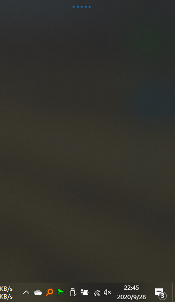
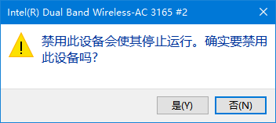
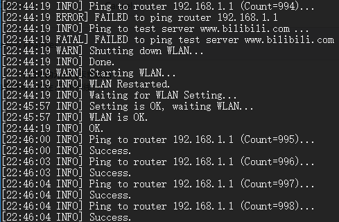
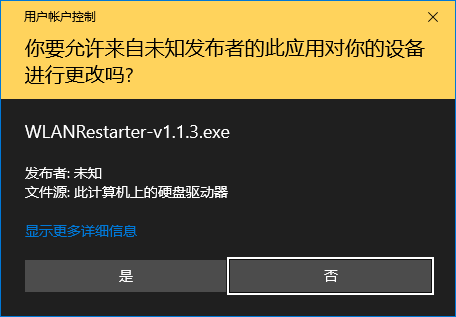
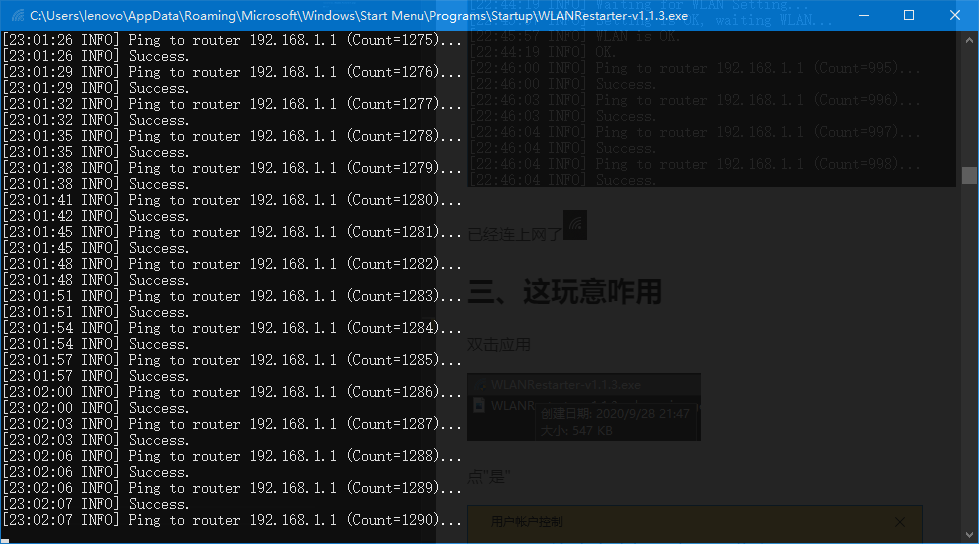

# WLANRestarter - 一个简单的无线网卡重启器

## 一、为啥要做这个软件
众所周知,部分Win10系统有个特性:网卡掉线!!!

心  肺  停  止

最后变成这样

#### 淦!

`怎样能让它自动恢复呢?`

于是,这个软件诞生啦! **WLANRestarter-无线网卡重启器**

## 二、这玩意有用吗

实验: 我把网卡暂时禁用以模拟掉线环境

可见,WLANRestarter迅速重启了网卡

已经连上网了

## 三、这玩意咋用

双击应用

点"是"

程序就开始运行了.

*P.S. 可以用 WLANRestarter -log指令将结果保存至log文件哦~*
======================================================
